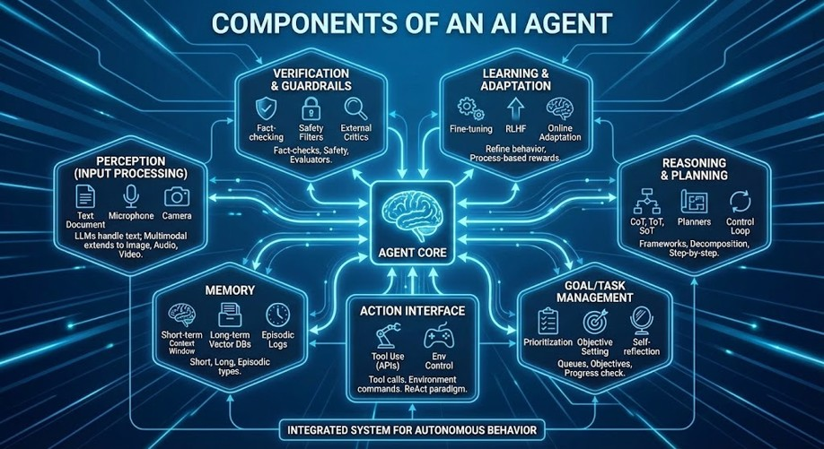

::: {.hero-banner}
# Trajectorium

Research, tutorials, and applied cases on AI agents and autonomous architectures.

[Explore the Blog &rarr;](blog/index.qmd){.btn .btn-primary .me-2}
[Tutorials &amp; Notebooks](notebooks/index.qmd){.btn .btn-outline-light}
:::

::: {.diagram-section}
## Components of an AI Agent

An integrated system for autonomous behavior: every modern AI agent combines a core language model with memory, tools, planning, and guardrails.

:::

## What is Trajectorium?

Trajectorium is a research and education platform focused on **agentic AI systems** — the next generation of AI that can perceive, plan, remember, and act autonomously. We publish accessible deep-dives, hands-on tutorials, and annotated lecture slides grounded in current research.

### Blog

In-depth articles on AI architectures, agent frameworks, reasoning patterns, and real-world applications.

[Read articles &rarr;](blog/index.qmd)

### Tutorials & Notebooks

Hands-on Jupyter notebooks: build agents from scratch, connect tools via APIs, and explore retrieval-augmented generation.

[Open notebooks &rarr;](notebooks/index.qmd)

### Slides

Lecture slides used in teaching — openly available for reuse and adaptation in your own courses.

[View slides &rarr;](slides/index.qmd)

